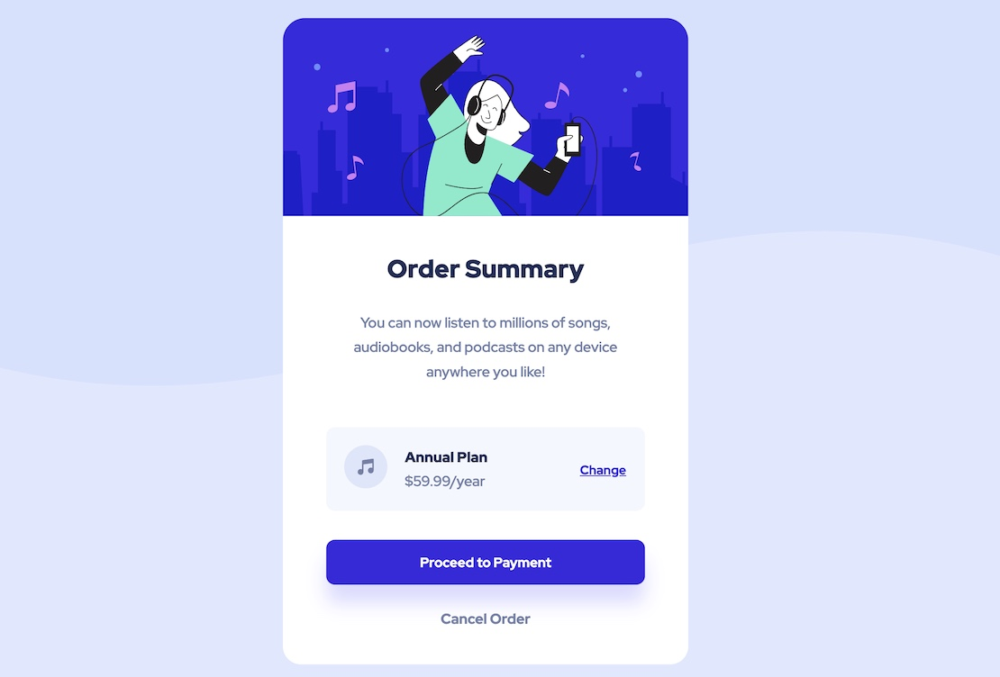

# Frontend Mentor - Order summary card solution

This is a solution to the [Order summary card challenge on Frontend Mentor](https://www.frontendmentor.io/challenges/order-summary-component-QlPmajDUj). Frontend Mentor challenges help you improve your coding skills by building realistic projects. 

## Table of contents

- [Overview](#overview)
  - [The challenge](#the-challenge)
  - [Screenshot](#screenshot)
  - [Links](#links)
- [My process](#my-process)
  - [Built with](#built-with)
  - [What I learned](#what-i-learned)
  - [Continued development](#continued-development)
  - [Useful resources](#useful-resources)
- [Author](#author)
- [Acknowledgments](#acknowledgments)

## Overview

### The challenge

Users should be able to:

- See hover states for interactive elements

### Solution

- Solution URL: [https://cocuzzo.github.io/FEM-order-summary-component/](https://cocuzzo.github.io/FEM-order-summary-component/)

#### Desktop screenshot



#### Mobile screenshot


## My process

### Built with

- Semantic HTML5 markup
- CSS Grid for layout & positioning
- CSS media query
- Chrome/Firefox dev tools for inspecting box model properties, emulating mobile screens

### What I learned

- CSS grid for layouts
- fundamentals of browser viewports
- Media queries for desktop & mobile screens
- REM text units for responsiveness
- Hover state

### Continued development

I'm not sure the layout is optimally responsive; some better techniques using REM/EM units would be more elegant. Background image scaling/positioning could be improved, narrow viewports result in the background image floating quite high rather than the transition cross-cutting the center of the viewport. Just a minor aesthetic detail.

Hover state appears to affect mobile interaction (taps 'turn on' hover behaviors), so further investigation to be done there.

Mobile design guide uses 375px viewport, which is small compared to modern beast smart phones. I'm sure there are industry conventions to use multiple device width/viewport thresholds to maximize compatibility.

I fussed with CS flexbox a bit on the plan details section, but ended up using CSS-grid with ```grid-auto-flow: column;``` instead of the default row.

## Author

- Website - [Daniel Cocuzzo](https://www.danc.bike)
- Frontend Mentor - [@cocuzzo](https://www.frontendmentor.io/profile/cocuzzo)
